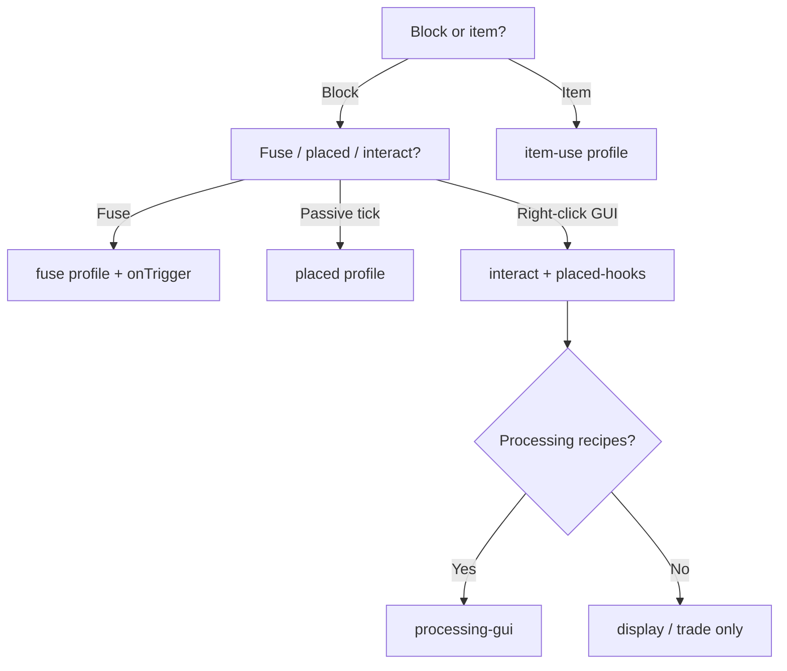

Extension manifests (`block-extension.yml` / `item-extension.yml`) can declare **profiles** (behavior hints) and **required integrations** (platform capabilities). Both are parsed at load time and documented in Javadoc on [`ExtensionManifest`](/developers/reference).

## Profiles

Profiles describe which strategy callbacks and services an extension uses. They do not change runtime dispatch — they help authors, reviewers, and tooling pick the right template.

| YAML token | Enum | Typical callbacks / services |
|------------|------|----------------------------|
| `fuse` | `FUSE` | `onTick`, `onTrigger`, `StrategyProfile` combustibility |
| `placed` | `PLACED` | `onPlaced`, `onPlacedBreak`, repeating scheduler |
| `interact` | `INTERACT` | `onPlacedInteract`, `CustomBlockAction.OPEN` |
| `placed-hooks` | `PLACED_HOOKS` | `onPlaced` + `onPlacedBreak` on interact blocks (GUI registration) |
| `item-use` | `ITEM_USE` | `onItemUse` |
| `processing-gui` | `PROCESSING_GUI` | `ExtensionSupport` inventories, tick-based recipes |
| `drop-collector` | `DROP_COLLECTOR` | `registerDropCollector` |

### Example

```yaml
id: prep-counter
name: Prep Counter
api-version: "1"
strategy: dev.rono.igniscore.block.prepcounter.Strategy
profiles:
  - interact
  - placed-hooks
  - processing-gui
```

## Required integrations

Declare integrations your extension needs for full behavior. At load time IgnisCore checks availability:

| YAML token | Enum | Bukkit | Sponge |
|------------|------|--------|--------|
| `protocol` | `PROTOCOL` | ProtocolLib when present | Not available (warns) |
| `nbt-entity` | `NBT_ENTITY` | Item NBT API | Sponge data containers |

Missing integrations **warn** by default so the extension still loads; features that depend on them should check `context.protocol().isEnabled()` or `context.nbt().isEnabled()` at runtime.

### Example

```yaml
id: entity-camera
requires-integrations:
  - protocol
profiles:
  - interact
```

## Choosing a template



## Manifest vs config ids

| Field | File | Purpose |
|-------|------|---------|
| Manifest `id` | `*-extension.yml` | Strategy registry key |
| Config `id` | `config.yml` | In-game type id (`/ignis give`, NBT) |

Keep them identical (e.g. `prep-counter`) to avoid confusion.

## Related

- [API layers](/developers/api/layers)
- [Extension Cookbook](/developers/cookbook)
- [Strategies](/concepts/strategies)
