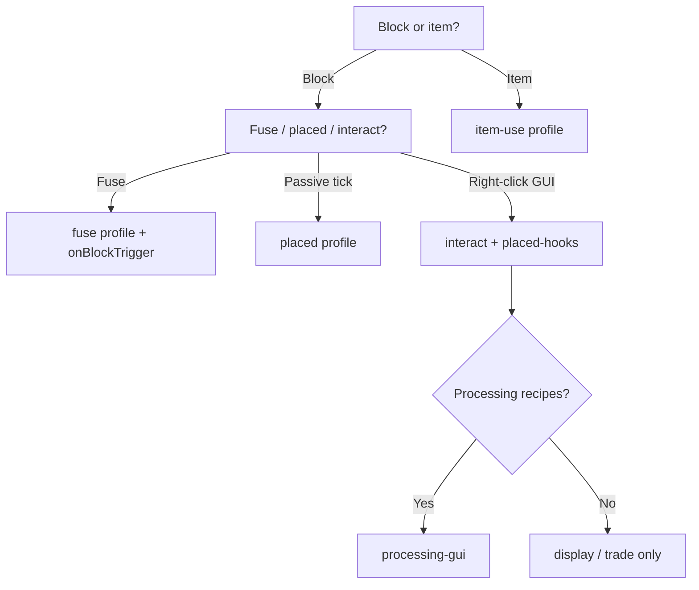

Extension manifests (`block-extension.yml` / `item-extension.yml`) can declare **profiles** (behavior hints) and **required integrations** (platform capabilities). Both are parsed at load time and documented in Javadoc on [`ExtensionManifest`](pathname:///apidocs/%%site.version%%/dev/rono/igniscore/api/extension/ExtensionManifest.html).

`profiles` are optional but recommended for new extensions — many bundled modules omit them and rely on strategy code alone.

## Profiles

Profiles describe which event bus hooks and services an extension uses. They do not change runtime dispatch — dispatch always goes through the event bus. Profiles help authors, reviewers, and tooling pick the right template.

| YAML token | Enum | Typical events / services |
|------------|------|---------------------------|
| `fuse` | `FUSE` | `onBlockTick`, `onBlockTrigger`, `StrategyProfile` combustibility |
| `placed` | `PLACED` | `onBlockPlace`, `onBlockBreak`, repeating scheduler |
| `interact` | `INTERACT` | `onBlockInteract`, `CustomBlockAction.OPEN` |
| `placed-hooks` | `PLACED_HOOKS` | `onBlockPlace` + `onBlockBreak` on interact blocks (GUI registration) |
| `item-use` | `ITEM_USE` | `onItemClick` |
| `processing-gui` | `PROCESSING_GUI` | `ExtensionSupport` inventories, tick-based recipes |
| `drop-collector` | `DROP_COLLECTOR` | `registerDropCollector` |

### Example (interact + GUI)

```yaml
id: picnic-basket
name: Picnic Basket
version: 1.0.0
api-version: 1.0.0
author: YourName
strategy: dev.rono.igniscore.block.picnicbasket.Strategy
profiles:
  - interact
  - placed-hooks
  - processing-gui
```

## Required integrations

Declare integrations your extension needs for full behavior. At load time IgnisCore checks availability:

| YAML token | Enum | Bukkit | Sponge |
|------------|------|--------|--------|
| `protocol` | `PROTOCOL` | ProtocolLib when present | Not available (warns) |
| `nbt-entity` | `NBT_ENTITY` | Item NBT API | Sponge data containers |

Missing integrations **warn** by default so the extension still loads; features that depend on them should check `context.protocol().isEnabled()` or `context.nbt().isEnabled()` at runtime.

### Example (protocol integration)

```yaml
id: entity-camera
name: Entity Camera
version: 1.0.0
api-version: 1.0.0
author: YourName
strategy: dev.rono.igniscore.block.entitycamera.Strategy
requires-integrations:
  - protocol
```

## Manifest parsing notes

- `api-version` must be semver (`major.minor.patch`, e.g. `1.0.0`).
- When `strategy` is omitted, the loader infers `dev.rono.igniscore.<block|item>.<package>.Strategy` from the manifest `id`.
- Legacy manifests may use `main:` instead of `strategy:`; the loader rewrites it at parse time.

## Choosing a template



## Manifest vs config ids

| Field | File | Purpose |
|-------|------|---------|
| Manifest `id` | `*-extension.yml` | Strategy registry key |
| Config `id` | `config.yml` | In-game type id (`/ignis give`, NBT) |

Keep them identical (e.g. `prep-counter`) to avoid confusion.

## Related

- [API layers](/developers/api/layers)
- [Extension Cookbook](/developers/cookbook)
- [Strategies](/concepts/strategies)
